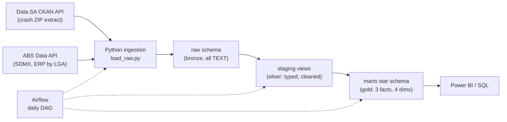

# SA Regional Data Platform

[](https://github.com/haider11011/sa-data-platform/actions/workflows/ci.yml)

An end-to-end, fully local data platform that answers a real question — **how do road crash outcomes across South Australian council areas compare once you account for how many people actually live there?** — built the way a production data team would: ELT from two unrelated public APIs, a medallion architecture in dbt, a star schema with conformed dimensions, Airflow orchestration, 100+ data quality checks, and CI that rebuilds the whole warehouse from live sources on every push.

Everything runs locally with Docker. No paid services, no API keys.

## The data story

Two South Australian government sources that have never heard of each other:

| Source | Dataset | Grain | Window |
|---|---|---|---|
| [Data.SA](https://data.sa.gov.au/data/dataset/road-crash-data) (CKAN) | SA Police road crash reports — crash, casualty and vehicle tables | one row per crash / person injured / vehicle | 2020–2024 |
| [ABS Data API](https://data.api.abs.gov.au) (SDMX) | Estimated Resident Population by LGA (`ABS_ANNUAL_ERP_LGA2024`) | LGA × year × sex × age band | 2015–2024 |

The crash data speaks in free-text council names (`DC MT.BARKER.`, `CC PT.AUGUSTA.`); the ABS speaks in coded LGAs (`Mount Barker` = 44550). Conforming the two into one shared region dimension is the core engineering problem this project solves — and what makes questions like *"casualties per 10,000 residents, by age group, by council, by year"* answerable with a safe join instead of a guess.

Example output from `marts.rpt_lga_crash_rates` (2024):

| LGA | crashes | fatalities | population | crashes per 10k |
|---|---|---|---|---|
| Adelaide | 584 | 2 | 29,118 | 200.6 |
| Walkerville | 134 | 0 | 8,562 | 156.5 |
| West Torrens | 782 | 1 | 65,738 | 119.0 |
| Port Adelaide Enfield | 1,290 | 3 | 141,042 | 91.5 |

(The CBD tops per-capita rates because the denominator is *residents*, not road users — the docs discuss why that caveat matters.)

## Architecture



Full diagrams (pipeline + star-schema ERD) and design rationale: [docs/architecture.md](docs/architecture.md).

**The star schema:** `fact_road_crashes` (grain: crash), `fact_crash_casualties` (grain: person injured), `fact_population_annual` (grain: LGA × year × sex × age band) sharing **conformed dimensions** `dim_region` (SCD Type 2 via dbt snapshot), `dim_date`, and `dim_age_band` (ABS bands, also applied to exact casualty ages), plus a `dim_crash_condition` junk dimension.

## Running it

Prerequisites: Docker (Desktop or colima), Python 3.11+, ~2 GB free RAM for Airflow.

```bash
git clone https://github.com/haider11011/sa-data-platform && cd sa-data-platform
cp .env.example .env

# 1. Bring up the platform (warehouse Postgres :5433, Airflow UI :8080)
docker compose up -d --build

# 2. Either: let Airflow run everything (UI: http://localhost:8080, admin/admin)
#    — unpause the sa_data_platform DAG, or trigger it manually:
docker compose exec airflow-scheduler airflow dags unpause sa_data_platform
docker compose exec airflow-scheduler airflow dags trigger sa_data_platform

# 2'. Or: run the pipeline by hand on the host
python3 -m venv .venv && .venv/bin/pip install -r requirements.txt
.venv/bin/python -m ingestion.load_raw --source all
cd dbt && ../.venv/bin/dbt deps --profiles-dir . && ../.venv/bin/dbt build --profiles-dir .
```

Airflow task logs: click any task square in the Grid view → Logs, or
`docker compose exec airflow-scheduler airflow tasks logs-for-dag-run ...`.

Connect Power BI (or anything) to the gold layer: host `localhost`, port `5433`, database `sa_warehouse`, user/password `warehouse`/`warehouse`, schema `marts`.

### dbt docs

```bash
cd dbt && ../.venv/bin/dbt docs generate --profiles-dir . && ../.venv/bin/dbt docs serve --profiles-dir .
```

Serves a browsable catalogue of every model, column description, test and the full lineage DAG at http://localhost:8080 (stop Airflow first, or pass `--port`).

## Orchestration

One Airflow DAG (`airflow/dags/sa_data_platform_dag.py`), daily:

```
ingest (Data.SA ∥ ABS)  →  dbt deps  →  dbt seed  →  dbt snapshot  →  dbt run  →  dbt test
```

The sources publish annually, so daily is more frequent than the data needs — the schedule demonstrates the orchestration pattern, and idempotent full-refresh ingestion makes over-running harmless. Every task is a plain shell command: transparent, retryable (2 retries with backoff for API blips), separately timed in the UI.

## Data quality

106 checks run on every build (and every push, in CI):

- `unique` + `not_null` on every primary/surrogate key at every layer
- `relationships` from every fact foreign key to its dimension
- `accepted_values` on all bounded categories (severity, sex, stats area, …)
- dbt-expectations range guards (ages 0–120, population cells, per-10k rates, fact row counts, date-spine end)
- singular cross-fact reconciliation: the crash table's casualty totals must equal the casualty table's row counts — proving the source archive and both pipelines agree end to end
- the LGA name-conformance bridge fails its `not_null` test if the source ever emits a name the rules + seed can't resolve: new names surface as a red build, never as silently dropped rows

## What this demonstrates

| Feature in this repo | Skill it evidences |
|---|---|
| CKAN + SDMX clients, dynamic resource resolution, retry/backoff | API ingestion engineering, not point-and-click ELT |
| All-TEXT bronze + typed silver + tested gold | Medallion architecture; "type in SQL, not in scripts" discipline |
| 3 fact tables sharing `dim_region`/`dim_date`/`dim_age_band` | Dimensional modelling with genuinely conformed dimensions |
| `int_lga_name_conformed` + override seed | Master-data conformance; the unglamorous 80% of real DE work |
| `region_snapshot` → versioned `dim_region` | SCD Type 2, including the backdated-first-version initialisation gotcha |
| `dim_crash_condition` | Junk dimension pattern with deterministic hash keys |
| Additive-cells-only population fact (verified against published totals) | Understanding additivity and BI double-counting risks |
| Airflow DAG with parallel ingest + staged dbt | Orchestration; task granularity and retry design |
| 106 tests incl. cross-fact reconciliation | Data quality as a designed system, not an afterthought |
| CI rebuilding the warehouse from live APIs per push | The pipeline's contract with its sources is continuously verified |

## Repository layout

```
├── docker-compose.yml       # warehouse Postgres + Airflow (metadata DB separate)
├── ingestion/               # Python API clients + raw loader
├── dbt/
│   ├── models/staging/      # silver: one view per raw table
│   ├── models/intermediate/ # the LGA name-conformance bridge
│   ├── models/marts/        # gold: star schema + report view
│   ├── snapshots/           # SCD2 region snapshot
│   ├── seeds/               # ABS age bands, LGA name overrides (with reasons)
│   └── tests/               # singular cross-fact reconciliation tests
├── airflow/dags/
├── docs/architecture.md     # diagrams + design decisions + caveats
└── .github/workflows/ci.yml
```

## Licences & attribution

Source data © Government of South Australia (Data.SA) and © Commonwealth of Australia (ABS), both under [CC BY 4.0](https://creativecommons.org/licenses/by/4.0/). This repository's code is MIT-licensed.
