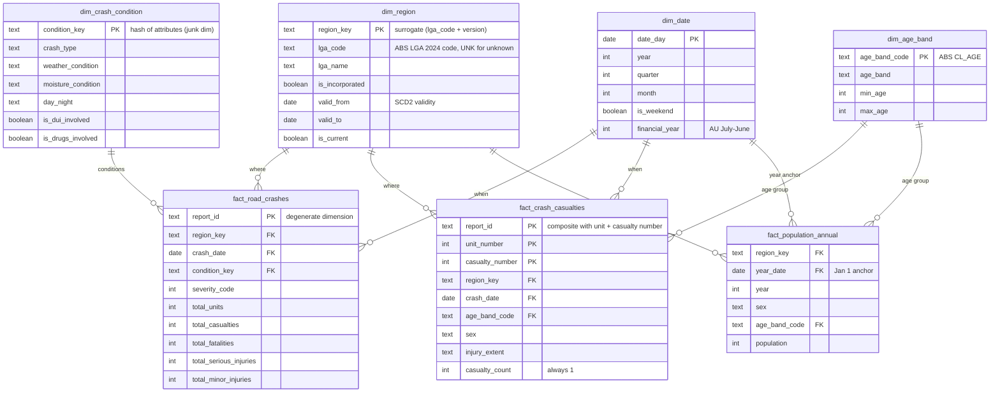

# Architecture

## Pipeline overview

```mermaid
flowchart LR
    subgraph sources["Source systems"]
        DSA["Data.SA CKAN API<br/>road-crash-data<br/>(latest 5-year ZIP extract)"]
        ABS["ABS Data API (SDMX)<br/>ABS_ANNUAL_ERP_LGA2024<br/>+ CL_LGA_2024 codelist"]
    end

    subgraph ingestion["Python ingestion (requests + psycopg2)"]
        ING["load_raw.py<br/>idempotent full refresh<br/>all columns TEXT + audit columns"]
    end

    subgraph warehouse["PostgreSQL warehouse"]
        subgraph bronze["raw (bronze)"]
            R1["data_sa_crashes"]
            R2["data_sa_casualties"]
            R3["data_sa_units"]
            R4["abs_erp_lga"]
            R5["abs_lga_codelist"]
        end
        subgraph silver["staging (silver) — dbt views"]
            S1["stg_data_sa__crashes"]
            S2["stg_data_sa__casualties"]
            S3["stg_data_sa__units"]
            S4["stg_abs__erp_lga"]
            S5["stg_abs__lga_codelist"]
            I1["int_lga_name_conformed"]
        end
        subgraph gold["marts (gold) — dbt tables"]
            D1["dim_region (SCD2)"]
            D2["dim_date"]
            D3["dim_age_band"]
            D4["dim_crash_condition"]
            F1["fact_road_crashes"]
            F2["fact_crash_casualties"]
            F3["fact_population_annual"]
            V1["rpt_lga_crash_rates (view)"]
        end
    end

    DSA --> ING
    ABS --> ING
    ING --> bronze
    bronze --> silver
    silver --> gold
    gold --> PBI["Power BI / any SQL client"]

    AF["Apache Airflow<br/>daily DAG: ingest → dbt deps → seed → snapshot → run → test"] -.orchestrates.-> ING
    AF -.orchestrates.-> silver
    AF -.orchestrates.-> gold
```

## Star schema

**Grain statements**

| Table | Grain |
|---|---|
| `fact_road_crashes` | one row per reported crash (2020–2024 extract) |
| `fact_crash_casualties` | one row per person injured in a crash |
| `fact_population_annual` | one row per LGA × year × sex × age band (additive base cells only) |

**Conformed dimensions** — `dim_region` and `dim_date` are shared by all three facts; `dim_age_band` is shared by casualties (exact ages bucketed) and population (native grain). This is what makes cross-source measures like *casualties per 10,000 residents per age group* safe to compute.

## Design decisions worth knowing

1. **One extract, three entities.** Data.SA publishes rolling 5-year ZIPs containing crash/casualty/unit CSVs. `REPORT_ID` is renumbered on every extract *and* embeds the extract date as a suffix, so the pipeline downloads exactly one (the latest) archive and lands all three tables from it — mixing extracts silently breaks joins. Staging strips the suffix to a stable `year-sequence` key.

2. **Name conformance is a model, not a hack.** Crash data carries free-text council names ("DC MT.BARKER.", "CC PT.AUGUSTA."); ABS speaks LGA codes. `int_lga_name_conformed` resolves every name via a documented normalisation rule chain plus a seed of explained exceptions (renamed councils, spelling differences). Unmatched names fail a `not_null` test instead of dropping fact rows.

3. **SCD Type 2 via dbt snapshot.** `dim_region` is versioned with `[valid_from, valid_to)` ranges from a `check`-strategy snapshot. Included to demonstrate the pattern — the codelist is stable within the data window, so each LGA currently has one version, with its first version backdated so pre-existing facts join. LGA renames are real (DC Mallala → Adelaide Plains, 2017), so the mechanism isn't hypothetical.

4. **Facts store only additive base cells.** ERP publishes totals (sex = Persons, age = Total) alongside the parts; additivity was verified exactly, and only the parts are stored so BI tools can't double-count.

5. **Bronze is untyped and dumb on purpose.** Raw tables are all-TEXT with `_ingested_at` / `_source_resource` audit columns; every cast, trim and rename happens in version-controlled, tested SQL. A bad value should fail a dbt test, not an ingestion script.

6. **Two Postgres instances.** The Airflow metadata DB is separate from the analytical warehouse — orchestration state and analytical data have different lifecycles and blast radii.

## Known interpretation caveats

- `rpt_lga_crash_rates` divides by *resident* population. Commuter-heavy LGAs (Adelaide CBD: ~30k residents, huge daily influx) show inflated per-capita rates. Correct denominator for exposure would be traffic volume, which isn't in these sources.
- ERP is a 30 June estimate anchored to 1 January in `fact_population_annual` purely as a day-grain join convention; analysis at year grain is unaffected.
- Casualty ages are masked (`XX`/`XXX`) in a small share of rows → `age_band_code` is NULL there and those casualties drop out of per-age-band rates (but not totals).
